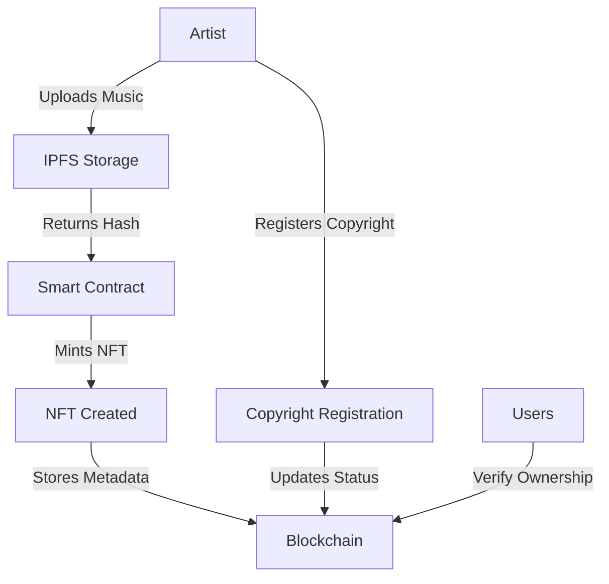

# Music NFT Copyright Protection Platform

## Overview
This smart contract implements a blockchain-based NFT platform that enables independent music artists to protect their intellectual property through NFT minting and copyright registration. The solution provides a decentralized, transparent, and cost-effective way for artists to prove ownership of their work.

## Problem Statement
New and independent music artists face challenges with:
- Expensive and slow traditional copyright registration
- Difficulty in proving ownership
- Risk of music piracy and unauthorized use
- Limited access to monetization opportunities

## Solution Architecture
The platform uses a combination of blockchain technology and NFTs to create an immutable record of music ownership and copyright registration.

### Key Components:
1. ERC721 Token Standard for unique NFTs
2. IPFS integration for decentralized storage
3. Metadata management system
4. Copyright registration mechanism
5. Ownership verification system

## Technical Implementation

### Smart Contract Features:

1. **NFT Minting**
   - Creates unique tokens for each music piece
   - Stores metadata including title, artist, and timestamp
   - Links to IPFS hash of the music file

2. **Copyright Registration**
   - Allows artists to register copyright claims
   - Creates immutable record of registration
   - Verifiable on the blockchain

3. **Ownership Management**
   - Tracks NFT ownership
   - Enables transfer of rights
   - Provides ownership verification

4. **Artist Portfolio**
   - Maintains list of artist's NFTs
   - Enables easy access to artist's work
   - Facilitates rights management

## Flow Diagram


## Technical Requirements
- Solidity ^0.8.0
- OpenZeppelin Contracts
- Web3 Storage (IPFS)

## Security Features
- Pausable contract functionality
- Access control mechanisms
- Ownership verification
- Immutable metadata storage

## Usage Guide

### For Artists:
1. **Minting NFTs**
   ```solidity
   function mintMusicNFT(string memory title, string memory ipfsHash, string memory tokenURI)
   ```

2. **Registering Copyright**
   ```solidity
   function registerCopyright(uint256 tokenId)
   ```

3. **Viewing Portfolio**
   ```solidity
   function getArtistNFTs(address artist)
   ```

### For Users:
1. **Verifying Ownership**
   ```solidity
   function verifyOwnership(uint256 tokenId, address claimedOwner)
   ```

2. **Accessing Metadata**
   ```solidity
   function getMusicMetadata(uint256 tokenId)
   ```

## Future Enhancements
1. Royalty distribution system
2. Collaborative ownership features
3. Integration with music streaming platforms
4. Automated copyright violation detection
5. Secondary market support

## Contributing
Feel free to submit issues and enhancement requests!

## License
This project is licensed under the MIT License.
